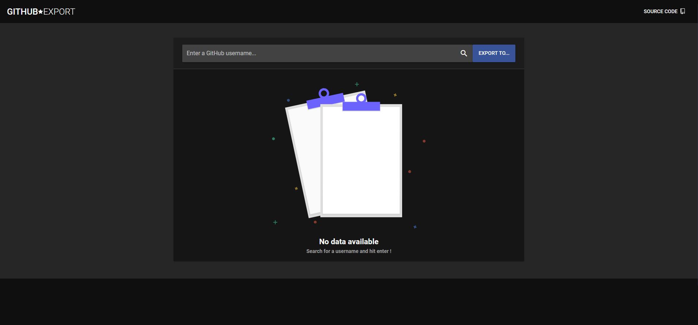

<h3 align="center">Export GitHub Stars</h3>

<p align="center">
    View, sort, and export starred Github repositories.
    <br>
</p>

<p align="center">
    <a href='https://github.com/standard/standard'>
    
    </a>
</p>



<br />

---

<br />

## Features
- Sort
  - Reverse (historical)
  - By language
  - Stars : ASC
  - Stars : DESC
- Export
  - HTML
  
  - JSON
  

## Project setup
```
npm install
```

<br />

---

<br />

## Commands:

### Compile & hot-reload for development
```
npm run serve
```

### Compile & minify for production
```
npm run build
```

### Run tests
```
npm run test
```

### Run your unit tests
```
npm run test:unit
```

### Customize configuration
See [Configuration Reference](https://cli.vuejs.org/config/).
